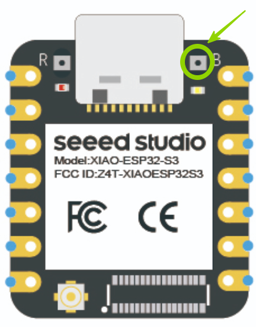
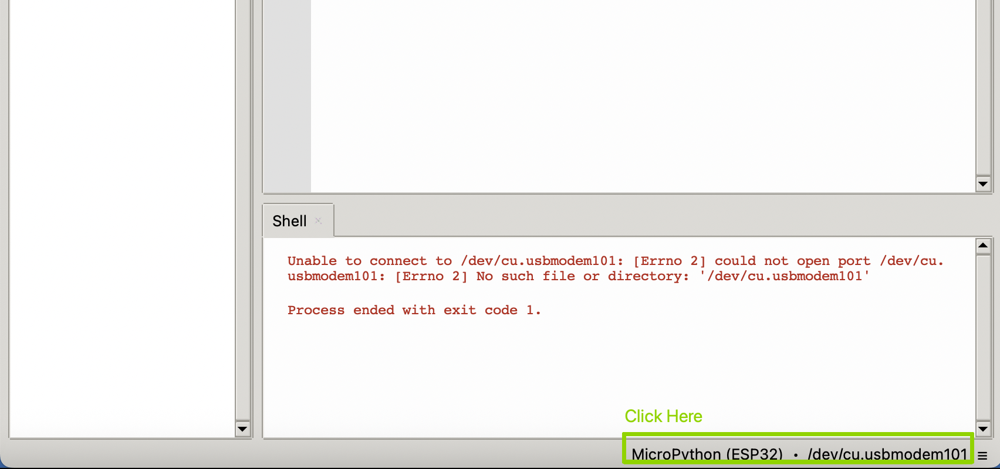
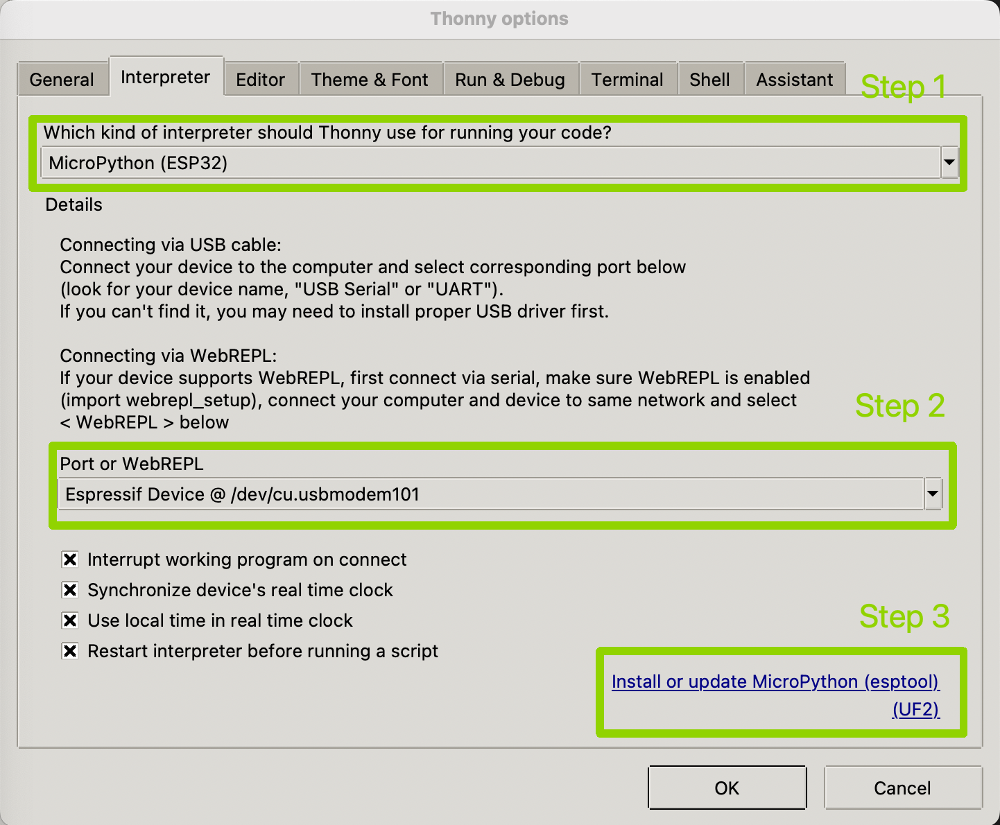
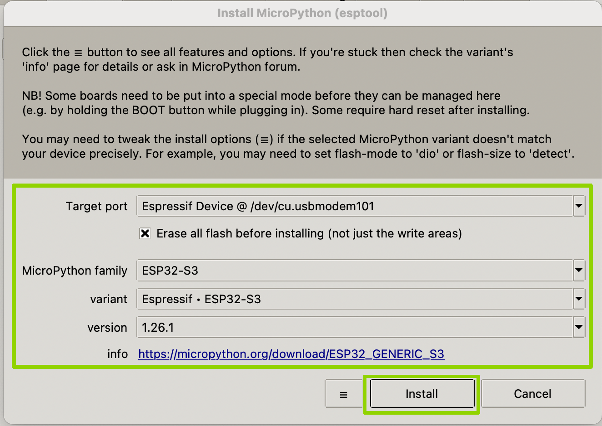
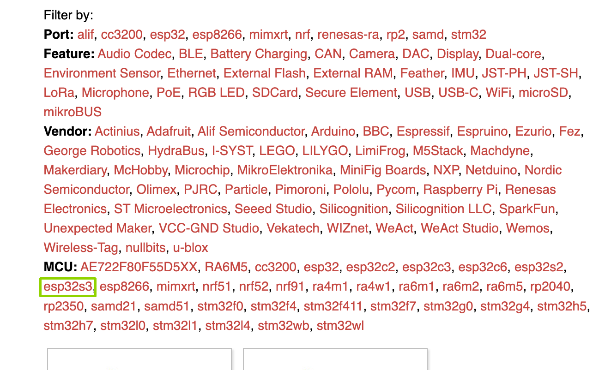
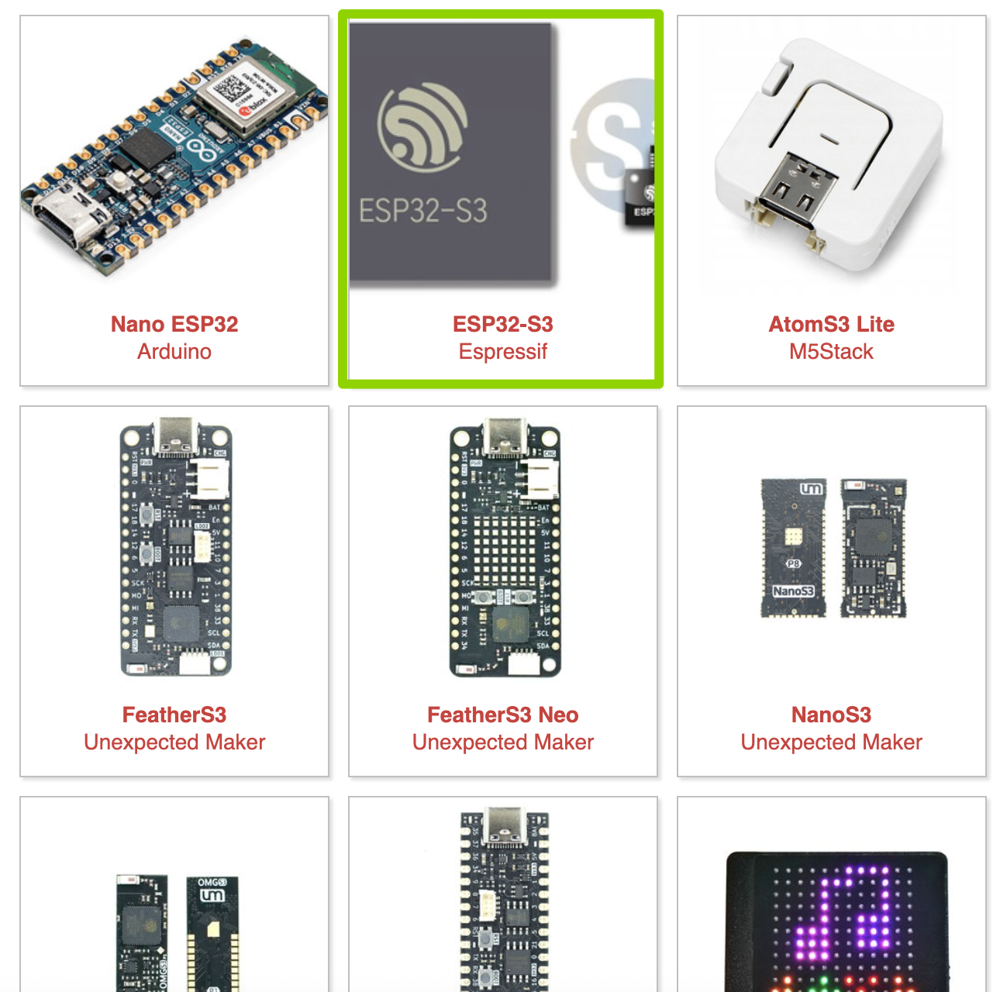

# {{ page.title }}
{: .no_toc }

## Table of Contents
{: .no_toc .text-delta }

1. TOC
{:toc}
---

## Installation of IDE 
The very first step for labs today is installation of the interactive development envirnoment you are going to use for the coding.  You can download Thonny from [here](https://thonny.org/).

<video controls width="400">
  <source src="./global_assets/thonnyinstall.webm" type="video/webm" />
</video>

## Flashing MicroPython Software
Connect ESP32S3 with Bootloader mode: Press and hold down the BOOT button while connecting the board with a type-C USB cable provided to the computer. After connecting, let go of the BOOT button.

After completing the installation of the Thonny IDE and ensuring the connection between ESP32S3 and your PC, the next step is completing the installation of Micropython firmware on the XIAO ESP32S3 Board.

You can continue through either:
- **Thonny**
- or using **Command Lines**.

  

### Flashing through Thonny
This is the simplest way I found as you can finish flashing through only several clicks.
1. Open Thonny and click the right bottom as below and you should see a **configure interpreter**. Then enter configure interpreter as below.

2. Select "interpreter kind" as MicroPython(ESP32), and the "Port or WebREPL" as the usbmodem101 or anything like it. For windows the port can be named as COM3 or anything like it. Then click **Install or update MicroPython (esptool) (UF2)** can be found at the right bottom.

3. Then select options as the figure below. (*the "Target port" can be different. You may need to select any looks like the one in the figure.*) Then click "Install" to erase and install firmware into ESP32S3.

### Using Command Lines
Follow the following step to accomplish this task in a hardcore way:
1. Install the corresponding firmawre:
    1. Launch MicroPython [website](https://micropython.org/).
    2. Click on [Download](https://micropython.org/download/) option from Navigation Menu.
    3. The Download page shows, various different MCUs for which MicroPython is available. From MCU section click on esp32s3.
    
    4. From options select ESP32-S3 Espressif.
    
    5. The page should now show all the releases. From Releases section, select the latest release this is indicated in bold and is the first item on the list. 
    6. Click the link to download the firmware file named with the end of ".bin".

2. Find your port name for further operations:
    1. Now, if our ESP32S3 is connected properly, we can find the device just connected to our computer. To find the device, we need to check the **Port Name** through either way from below:
        - **Windows**:
            - open **Device Manager-->Serial Port**, there should be a device with the named of **"COMX"**, X can be a figure, e.g., "COM3" or "COM4".
        - **MacOS & Linux**: on your terminal try command
            - `ls /dev/cu*` for MacOS
            - `ls /dev/ttyS* /dev/ttyUSB*` for Linux

3. Erase and Write using esptool:

    1. Download **esptool**: open your Command Line or Terminal and try `pip install esptool`. Then, try `esptool -h` or `esptool.py -h` to see if esptool is ready.
    2. Now we need to use esptool to erase the flash in ESP32S3 and write the firmware into ESP32S3 using the commands with the **Port Name** and the **Bin File** from the steps above.
        1. **Erase**: 
        ``esptool.py --chip esp32s3 --port [Port Name] erase_flash``

        2. **Write**: 
        ``esptool.py --chip esp32s3 --port [Port Name] --baud 460800 write_flash -z 0x0 [Bin File]``

    {: .note }
    For example, let's say I found my port name is `/dev/cu.usbmodem1101` and my bin file is `ESP32_GENERIC_S3-20250911-v1.26.1.bin`. 
    Then I type this down, ``esptool.py --chip esp32s3 --port /dev/cu.usbmodem1101 --baud 460800 write_flash -z 0x0 ESP32_GENERIC_S3-20250911-v1.26.1.bin``    

    Then you should be able to go through step 1 and 2 in Thonny to connect to your ESP32S3 and test your code.

## Thony IDE Tutorial
Once you have got the MicroPython firmware on the board, you can use REPL prompt in Thonny to test Python Commands. The video below gives a quick walkthrough of basic features.

<video controls width="400">
  <source src="./global_assets/thonnyUsage.webm" type="video/webm"/>
</video>

Some other places to find detailed account of IDE features include:
1. Thonny's own website and Introductory [Video](https://www.youtube.com/watch?v=nwIgxrXP-X4)
2. Random Nerd's [Page](https://randomnerdtutorials.com/getting-started-thonny-micropython-python-ide-esp32-esp8266/) which is for different processor but same steps really.
3. ESP32S3 [Guidance](https://projects.raspberrypi.org/en/projects/getting-started-with-the-pico/2).
<!-- 4. Micropython [Book](./global_assets/book.pdf) from Raspberry Pi Foundation. -->

<!-- ## Board Details and Relevant Documents
All relevant documents is below:
1. Product [Page](https://wiki.seeedstudio.com/xiao_esp32s3_getting_started/) by SeeedStudio. -->