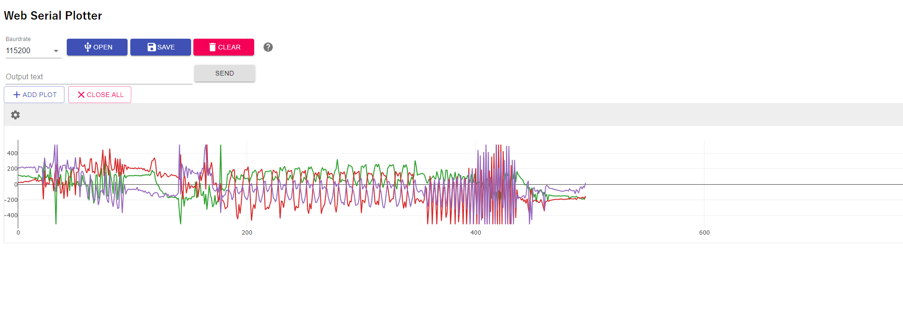

# {{ page.title }}
{: .no_toc }

## Table of Contents
{: .no_toc .text-delta }

1. TOC
{:toc}
---

# LK's eVTOL and its Tracking
In this lab the aim is to build a navigation and tracking system for LK's eVTOL using Accelerometer. We will learn, how to encode data into binary form so that we are ready to wirelessly transmit this information over Wide Area Networks.

## Story Line and Action Plan
LK has an assistant called Moneyworth, he likes to track LKs mobile during his special Ops. In today's lab we are going to build Accelerometer based system to measure X-Y-Z displacement and acceleration. Our key task is to encode this information into binary form so that this could be transmitted over the wide area wireless network in next lab.


# So what is Accelerometer?
Simply an accelerometer measures change in velocity with respect to an observer who is free fall. What is simply means is that when an accelerometer is static it read 0 m/s^2 acceleration istead of 9.8 m/s^2 . What we are going to use today is 3-axis digital accelerometer. 
[Link to Accelerometer Specs](https://www.seeedstudio.com/Grove-3-Axis-Digital-Accelerometer-16g.html)

ADXL345 is a small, thin, ultra low power 3-axis accelerometer, providing high resolution (13-bit) measurement at up to ±16 g. It measures the static acceleration of gravity in tilt-sensing applications, as well as dynamic acceleration resulting from motion or shock. The ADXL345 is interfaced with the MCU using I2C Protocol.


# I2C Protocol

The Inter-Integrated Circuit (I2C) Protocol is intended for connecting multiple **integrated chips** (ICs) with a **controller**. The protocol is intended for short-distance communication and requires only two wires for establishing connection.

Source: Sparkfun


# Back to the Lab

Your task today is to read (x,y,z) from accelerometer. Based on these values, we can calculate (roll,pitch). Follow the following steps:
1. Create a new folder called Lab 2.
2. Navigate to this folder from Thonny IDE.
3. Create two new files in this folder, one called **main.py** and other called **accelerometer.py**.
4. In **accelerometer.py** file copy the code which is provide below.

```python
from machine import Pin,I2C
import math
import time

device = const(0x53)
regAddress = const(0x32)
TO_READ = 6
buff = bytearray(6)

class ADXL345:
    def __init__(self,i2c,addr=device):
        self.addr = addr
        self.i2c = i2c
        b = bytearray(1)
        b[0] = 0
        self.i2c.writeto_mem(self.addr,0x2d,b)
        b[0] = 16
        self.i2c.writeto_mem(self.addr,0x2d,b)
        b[0] = 8
        self.i2c.writeto_mem(self.addr,0x2d,b)

    @property
    def xValue(self):
        buff = self.i2c.readfrom_mem(self.addr,regAddress,TO_READ)
        x = (int(buff[1]) << 8) | buff[0]
        if x > 32767:
            x -= 65536
        return x
   
    @property
    def yValue(self):
        buff = self.i2c.readfrom_mem(self.addr,regAddress,TO_READ)
        y = (int(buff[3]) << 8) | buff[2]
        if y > 32767:
            y -= 65536
        return y
     
    @property   
    def zValue(self): 
        buff = self.i2c.readfrom_mem(self.addr,regAddress,TO_READ)
        z = (int(buff[5]) << 8) | buff[4]
        if z > 32767:
            z -= 65536
        return z
           
    def RP_calculate(self,x,y,z):
        roll = math.atan2(y , z) * 57.3
        pitch = math.atan2((- x) , math.sqrt(y * y + z * z)) * 57.3
        return roll,pitch

```
5. In **main.py** now import the ADXL345 class stored in the **accelerometer.py** like this:

```python
from accelerometer import ADXL345
```
6. Now write code to print (x,y,z), as well as roll and yaw from the accelerometer. Make sure you connect the accelerometer given to you to Grove port (one of the white connectors on boar) attached to GPIO2 and GPIO3. See following snippet and try to complete it:

```python
from machine import Pin,I2C
import time
from accelerometer import ADXL345

i2c = I2C(1,sda=Pin(2),scl=Pin(3), freq=10000)
adx = ADXL345(i2c)

while True:
   #code to print the values
    time.sleep_ms(50)
```


7. Now to visualise the data, try using web serial demo here: [Web Serial](https://sekigon-gonnoc.github.io/web-serial-plotter/)
8. You have to select right COM Port and 115200 as the baud rate. See the snapshot below:

9. Now you can try a few different gestures and see the patterns.
10. Finally, if it is of interest to you explore how you can implement Machine Learning to learn the gestures see here for instance: [TinyML](https://dev.to/tkeyo/tinyml-machine-learning-on-esp32-with-micropython-38a6)

# Transforming the data into bits
Before LK's position can be transmitted over wireless wide area network. You need to transform x,y,z values into binary form. The values presented here are in integer format any way making your life easy. If you look into data sheet you can work out how to convert these back to proper units but we do not really need to worry about this yet.
1. Now we need to convert this data into binary format and then store in byte array which can be transmitted. 
2. The format for the packet will be as follows:

**Format** 
Initial three bits will be used for sign of the number so b0,b1,b2 are 1 if the number is negative, else 0. The next 2 bytes are for value of x, then 2 bytes for y and then 2 bytes for z.


