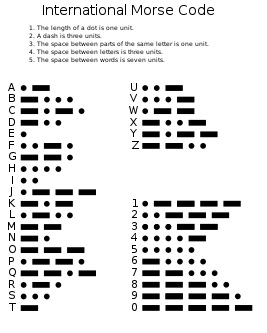

# {{ page.title }}
{: .no_toc }

## Table of Contents
{: .no_toc .text-delta }

1. TOC
{:toc}
---

This chapter will provide a brief overview of MicroPython.

# MicroPython: The Embedded Code Knight Rises
MicroPython is essentially Python on Keto diet. It is a lean and efficient implementation of Python, geared towards programming the embedded systems. MicroPython wields a selective arsenal, a subset of Python libraries which are required to perform necessary tasks on constrained devices.


{: .note }
The credit for making your life easier goes to the Damien George, who developed MicroPython in 2013. The idea was to bring the high level programming language to embedded systems developers. 

# The Story of LK


In the bustling metropolis of Leeds City, there exists a remarkable superhero known as LK, whose extraordinary abilities lie not in super strength or flight, but in the realm of coding and technological ingenuity. LK, whose identity remains shrouded in mystery, harnesses the power of programming to craft ingenious gadgets and tools to combat crime and protect the citizens of Leeds. Armed with a brilliant mind and an arsenal of high-tech gadgets, LK navigates the city's streets with unparalleled precision, using coding as their superpower to outwit even the most cunning adversaries. Whether it's hacking into security systems, constructing intricate devices on the fly, or analyzing data to anticipate criminal activity, LK's coding prowess knows no bounds. With each keystroke, they weave a digital tapestry of justice, ensuring that Leeds City remains safe from harm.

Throughout the rest of the labs, we will be trying to trace his steps and replicate some gadgets from his arsenal.

## LK's early days
So the very first program every programmer needs to learn to write is for printing "Hello world!". This seems to be an obsession.  Why is this the case? Well there is a Wikipedia article describing [this](https://en.wikipedia.org/wiki/%22Hello,_World!%22_program)But then again LK was unconventional. His first programming stint included creating a light show on a embedded board. Luckily, you have got the same board. He started with flashing LED connected with GPIO21. The LED toggled from high to low after 100 ms. Your mission, if you choose to accept is replicating his steps. Before you embark on this task go through the MicroPython Beginner's [Guide](./mpython).

Ok, Now that we know a fair amount of the basic stuff, it's time for disco lights. I mean that literally. The board you've been given has one addressable LED. An addressable LED allows you to use a single pin (GPIO 21) to control an entire strip. Let's play with it by trying the following snippet, which blinks the LED a specific number of times and then stops:

```python
import machine
import time
led = machine.Pin(21, machine.Pin.OUT)
# Blink 5 times
for i in range(5):
    led.off()
    time.sleep(0.5)
    led.on()
    time.sleep(0.5)
```

## Inventing LK's Communication System
As LK grew up, he realised that this example was not much useful. Inspired by the Batman who used to merely flash his logo in the sky to enable one bit communication, the LK thought of something even more cool. May be his fondness of light-show can now turn in to creating a viable wireless communication system. A very primitive one yet a powerful example. He realised he can implement Morse Code by flashing the lights on the board. Therefore, implemented a system where any message provided by him could be transformed into Morse Code. He then started broadcasting these flashes to his friend who has smart phone with an app for decoding these messages. 

<details>
<summary>Task 1</summary>
Your final mission today, if you choose to accept it, is implementing Morse code generator using the LED on the board. Store a message to be transmitted in some variable and then convert this message into Morse Code.
</details>



If you need help, try completing skeleton code below:

```python
import machine
import time
led = machine.Pin(21, machine.Pin.OUT)  
# LED is connected to Pin 21
#declare a dictionary which has mapping between characters and code

CODE = {'A':'.-','B':'-...',....}


def flashled(t):
    #write a function to flash LED for t sec
    return


message = "Hello World"

def send():
  #Use international standard for on/off times for dash, dot, space and word ends
    tdot= 0.12 #sec
    tdash = tdot * 3
    tspace = tdot * 3
    tword = tdot * 7
    
    
    
    #write code to make sure LED is Off
    
    for l in message:
       #l will now be a letter
        c = #get the corresponding code
        for e in c:
            #e will be characters in code
           if #write code to check what is the character
               #blink the LED
               time.sleep(tdot)
          #repeat above block to check for dash dot and end of word

        time.sleep(tword)
    

while True:
    send()
    time.sleep(1)
```

<details>
<summary>Something to try</summary>
Next up, look up for the data sheet and schematic of the board. Find out how to play tunes on built in buzzer. Then why not try and program the buzzer to play morse code tune.
</details>

If you want to check wether your Morse Code can be decoded correctly then download a Morse Code Engineer App on your smart phone and use camera to watch the decoded output.


